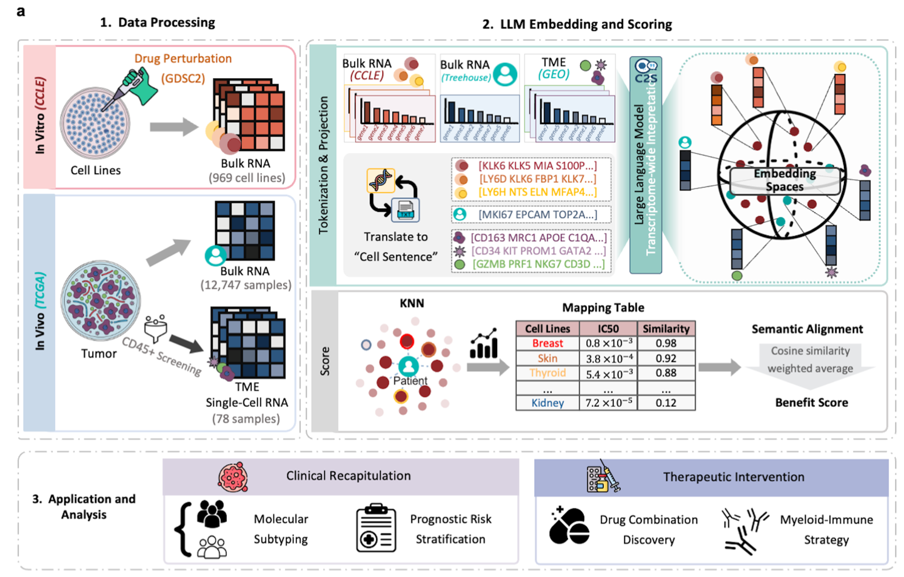

<p align="center">
  <h1 align="center">ASPECT</h1>
  <p align="center"><strong>A</strong>nchoring <strong>S</strong>emantic <strong>P</strong>henotypes for <strong>E</strong>ffective <strong>C</strong>ancer <strong>T</strong>reatment</p>
  <p align="center"><em>A generalizable language model framework bridging cross-context transcriptomes for cancer therapy prediction</em></p>
</p>

<p align="center">
  
</p>

---

Predicting patient-specific drug response is vital for advancing precision oncology, as it enables the pre-emptive identification of effective therapeutic interventions while bypassing the practical constraints of clinical testing. However, although large-scale screens in cancer cell lines serve as the primary foundation for sensitivity modeling, the systematic divergence between cell line and tumor transcriptomes from real patients remains a major barrier to reliable cross-domain translation, limiting the fidelity of prediction transfer. Analogous to how words derive meaning from sentential context, genes acquire functional meaning within their transcriptomic context, allowing transcriptomes to be interpreted as a semantic language. We therefore propose ASPECT (**A**nchoring **S**emantic **P**henotypes for **E**ffective **C**ancer **T**reatment), a framework that leverages Large Language Models to align cross-context transcriptomes between patient tumors and cell lines. By characterizing semantic phenotypes including metabolic activity, proliferation, and malignancy, ASPECT matches patient samples to reference cell lines and reconstructs a drug benefit score quantifying therapeutic sensitivity. Specifically, we integrated transcriptomic profiles from 1,019 cell lines with drug sensitivity screening data across 286 drugs to interpret 14,197 multi-source patient samples, spanning a comprehensive spectrum of adult and pediatric malignancies across more than 80 cancer types. We demonstrated the model's efficacy in chemotherapy sensitivity prediction, patient stratification and prognosis assessment, with an average AUC improvement of 0.35 over existing baselines. Furthermore, by analyzing 78 single-cell RNA (scRNA)-seq samples from 22 triple-negative breast cancer patients, we decoded extrinsic immune microenvironment dynamics. Our framework identifies patients with hot-but-suppressed microenvironments as ideal candidates for chemo-immunotherapy, providing a novel, interpretable strategy to guide clinical decision-making.

---

## Built Upon

- [CellHit](https://github.com/raimondilab/CellHit) — Drug sensitivity prediction from transcriptomic data
- [Celligner](https://github.com/broadinstitute/celligner) — Cross-dataset transcriptomic alignment

---

## Repository Structure

```
.
├── ASPECT/                          # Self-contained Python package
│   ├── __init__.py                  #   Package initialization
│   ├── dataset_loaders.py           #   Data loading, DatasetLoader, IndexedArray
│   ├── gen_gene_list.py             #   Mechanism-based gene selection (GeneGetter)
│   └── celligner.py                 #   Celligner alignment utilities
├── scripts/                         # Analysis pipeline (numbered by execution order)
│   ├── 0_prepare_indications.py     #   Standardize clinical indications
│   ├── 1_prepare_celligner.py       #   CCLE-TCGA Celligner alignment
│   ├── 2_gen_prompts.py             #   Generate text prompts (ASPECT-2k / ASPECT-comb)
│   ├── 3_gen_embedding.py           #   Generate C2S-Scale embeddings
│   ├── 4_predict_sensitivity.py     #   Predict drug sensitivity (k-NN / GPR / LightGBM)
│   ├── 5_validate_predictions.py    #   Validate with clinical indications
│   └── 6_analysis_pipeline.R        #   Downstream R analysis (15 sections)
├── celligner2/                      # Celligner2 package (external dependency)
├── framework.png                    # ASPECT framework diagram
├── requirements.txt                 # Python dependencies
└── README.md
```

---

## Dependencies

### Python

Core dependencies (see `requirements.txt`):

- `pandas >= 1.5.0`, `numpy >= 1.21.0`, `scipy >= 1.7.0`
- `scikit-learn >= 1.0.0`, `lightgbm >= 3.3.0`
- `torch >= 2.0.0`, `transformers >= 4.30.0`, `bitsandbytes >= 0.41.0`
- `celligner` (for script 1)

### R

- `tidyverse`, `janitor`, `ggplot2`, `ggpubr`
- `TCGAbiolinks` (subtypes & clinical)
- `survival`, `survminer`, `forestmodel` (survival analysis)
- `mlr3`, `mlr3learners`, `mlr3viz`, `ranger` (ML classification)
- `psych`, `patchwork`

---

## Installation

```bash
git clone <repository-url>
cd aspect

# Python
pip install -r requirements.txt

# R
R -e "install.packages(c('tidyverse','janitor','ggplot2','ggpubr','TCGAbiolinks','survival','survminer','forestmodel','mlr3','mlr3learners','mlr3viz','ranger','psych','patchwork'))"
```

---

## Usage

### Step 0: Prepare Clinical Indications

```bash
python scripts/0_prepare_indications.py \
    --nci_input ./data/metadata/nci_compiled_dataset.csv \
    --gdsc_mapping ./data/metadata/gdsc_pubchem_mappings.csv \
    --output_csv ./results/gdsc_clinical_indications.csv
```

### Step 1: Celligner Alignment

```bash
python scripts/1_prepare_celligner.py \
    --data_path ./data/transcriptomics \
    --output_path ./data/transcriptomics
```

### Step 2: Generate Prompts

Two feature selection strategies are available:

**ASPECT-2k** — Top-2000 expressed genes for both CCLE and TCGA:

```bash
python scripts/2_gen_prompts.py \
    --strategy ASPECT-2k \
    --celligner_path ./data/transcriptomics/celligner_CCLE_TCGA.feather \
    --output_path ./results \
    --top_n_genes 2000
```

**ASPECT-comb** — Knowledge-based genes for CCLE (gdsc/prism), Top-2000 for TCGA:

```bash
python scripts/2_gen_prompts.py \
    --strategy ASPECT-comb \
    --dataset gdsc \
    --data_path ./data \
    --celligner_path ./data/transcriptomics/celligner_CCLE_TCGA.feather \
    --output_path ./results \
    --top_n_genes 2000
```

### Step 3: Generate Embeddings

```bash
python scripts/3_gen_embedding.py \
    --model_path ./model/c2s-scale-gemma-2 \
    --prompts_file ./results/ccle_top2000_prompts.csv \
    --output_dir ./results/embeddings \
    --smart_batching
```

### Step 4: Predict Sensitivity

**ASPECT-2k mode** (CCLE prompts without DrugID):

```bash
python scripts/4_predict_sensitivity.py \
    --ccle_strategy topn \
    --ccle_prompts ./results/ccle_top2000_prompts.csv \
    --ccle_embeddings ./results/embeddings/ccle_embeddings.npy \
    --tcga_prompts ./results/tcga_top2000_prompts.csv \
    --tcga_embeddings ./results/embeddings/tcga_embeddings.npy \
    --dataset gdsc --data_path ./data \
    --model_type knn --k_neighbors 10 \
    --output_file ./results/predictions.csv
```

**ASPECT-comb mode** (CCLE prompts with DrugID):

```bash
python scripts/4_predict_sensitivity.py \
    --ccle_strategy knowledge \
    --ccle_prompts ./results/gdsc_ccle_mechanism_prompts.csv \
    --ccle_embeddings ./results/embeddings/ccle_embeddings.npy \
    --tcga_prompts ./results/tcga_top2000_prompts.csv \
    --tcga_embeddings ./results/embeddings/tcga_embeddings.npy \
    --dataset gdsc --data_path ./data \
    --model_type knn --k_neighbors 10 \
    --output_file ./results/predictions.csv
```

### Step 5: Validate Predictions

```bash
python scripts/5_validate_predictions.py \
    --predictions_csv ./results/predictions.csv \
    --phenotype ./data/metadata/clinical_TumorCompendium_v11_PolyA_for_GEO_20240520.tsv \
    --indications_file ./results/gdsc_clinical_indications.csv \
    --output_dir ./validation_results \
    --top_n 600
```

### Step 6: Downstream Analysis (R)

```r
source("scripts/6_analysis_pipeline.R")
# Edit file_list paths at top of script before running
```

15 analysis sections: Model Comparison → Neighbor Lineage → Cross-Cancer Enrichment → Tumor Purity → Subtype Validation → CBI Analysis → Immune/Purity → CCLE IC50 → ML Classification → Survival (KM+Cox) → CBI Variants → BRCA Subtype Survival → LGG TOP2A → Drug Combinations → Panel Figures.

---

## Key Features

### Two Prompt Strategies

| Strategy | CCLE Gen Selection | TCGA Gene Selection |
|----------|-------------------|---------------------|
| `ASPECT-2k` | Top-2000 per cell line | Top-2000 per sample |
| `ASPECT-comb` | Knowledge-based (LLM + ligand + target + KEGG + downstream) | Top-2000 per sample |

### Multiple Regression Backends

- **k-NN** — K-nearest neighbors with distance weighting
- **GPR** — Gaussian Process Regression with uncertainty
- **LightGBM** — Gradient boosting for non-linear patterns

### Validation

- **Hypergeometric enrichment** — on-label samples enriched in top predictions
- **AUC** — ROC area under curve
- **Recall@Top-N** — fraction of on-label samples in top N

---

## Notes on CellHit Dependency

This repository has been refactored to remove dependencies on the external `CellHit` package. All required functionality is integrated into the `ASPECT` package:

- `obtain_metadata()` — Loads GDSC/PRISM drug sensitivity metadata
- `GeneGetter` — Mechanism-aware gene selection from multiple knowledge sources
- `IndexedArray` — Efficient array indexing for transcriptomic data
- `DatasetLoader` — Data splitting, scaling, and preparation

---

## Citation

If you use this code in your research, please cite:

```
[Manuscript citation to be added]
```

---

## License

[License information to be added]

---

## Contact

For questions or issues, please open an issue on GitHub or contact the authors.
